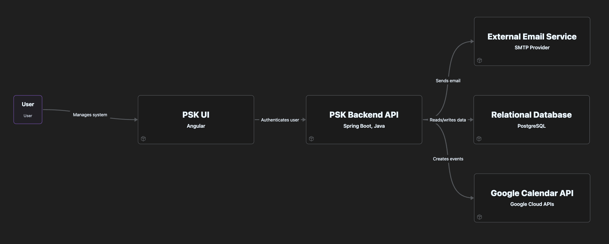
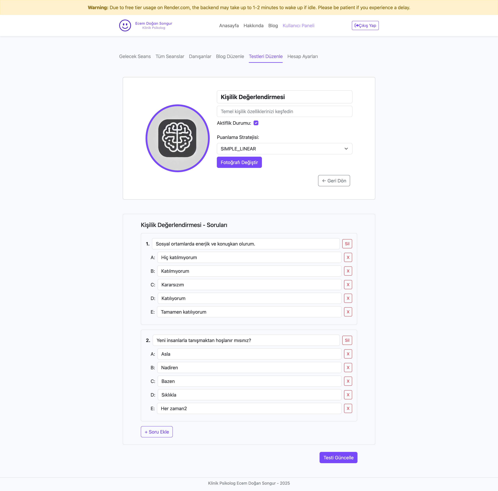

# PSK Full Stack 👩‍⚕️🗕️🧠

A secure, full-featured web platform for psychologists to manage sessions, patients, and assessments — built using **Spring Boot**, **PostgreSQL**, and **Angular**.

## 🚀 Overview

This application allows psychologists and clients to:
- Manage appointment bookings (integrated with Google Calendar),
- Create and take psychological assessments,
- View and edit blog articles,
- Authenticate and manage user profiles securely,
- Provide admin tools for user/session/blog/test management.

> Designed with clean code principles, layered architecture, and a focus on real-world scalability.

---

## 🧐 Core Features

### 👩‍⚕️ Frontend — Angular
- **Modular UI** with feature-based modules: Auth, Blog, Session, Test, User, Admin.
- **API Client Layer** to interact with backend services.
- **JWT Authentication** with protected routes for users and admins.
- **Role-based Access Control** and dynamic navigation.
- **Responsive Design** using Angular Material & TailwindCSS.

### ⚙️ Backend — Spring Boot (Java)
- **RESTful API** with secure, versioned endpoints.
- **Spring Security** with JWT-based auth and filter chains.
- **Layered Architecture** (Controller, Service, Repository).
- **Email Service** (SMTP) for registration and session reminders.
- **Scheduler** to auto-update session statuses.
- **Google Calendar API** integration for session appointments.
- **Multi-version APIs** for backward compatibility (`/v2`, `/v3`).
- **File Upload Service** for test-related documents or reports.

### 🗄️ Database — PostgreSQL
- Normalized schema for users, sessions, tests, blogs, and roles.
- Stores session events, test results, uploaded file metadata.

---

## 🔐 Security

- **Spring Security + JWT** for stateless auth.
- **Role-based authorization** (Admin, Psychologist, Client).
- **CORS and CSRF protection**.
- Passwords are hashed using BCrypt.

---

## 🔧 DevOps & Deployment

- **Dockerized** frontend and backend.
- **GitHub Actions** for CI/CD pipelines.
- Environment configurations separated via `.env`.
- Supports local development with Docker Compose.

---

## 📡 External Integrations

- **Google Calendar API** – Automatically creates session events for appointments.
- **SMTP Email** – Sends verification and reminder emails via an external provider.

---

## 📁 Project Structure

```
psk-full-stack/
│
├── backend/ (Spring Boot)
│   ├── modules/
│   │   ├── auth
│   │   ├── session
│   │   ├── test
│   │   └── user
│   ├── scheduler/
│   ├── security/
│   └── config/
│
├── frontend/ (Angular)
│   ├── modules/
│   │   ├── auth
│   │   ├── blog
│   │   ├── session
│   │   ├── test
│   │   ├── user
│   │   └── admin
│   └── services/
│
└── docker-compose.yml
```

---

## Screenshots

### App Architecture


### Login Page


### Session Calendar


### Test Management UI



---

## 🛠️ Technologies Used

| Layer         | Tech Stack                                      |
|---------------|--------------------------------------------------|
| Frontend      | Angular, TypeScript, HTML/CSS, Tailwind         |
| Backend       | Java, Spring Boot, Spring Security, JPA, JWT    |
| Database      | PostgreSQL                                      |
| DevOps        | Docker, GitHub Actions, Docker Compose          |
| Integrations  | Google Calendar API, SMTP Mail                  |
| Tools         | IntelliJ, Postman, Git                          |

---

## 👤 Author

**Hasan Burak Songur**  
📍 İzmir, Türkiye  
📧 [hasanburaksongur@gmail.com](mailto:hasanburaksongur@gmail.com)  
🔗 [LinkedIn](https://linkedin.com/in/hasanburaksongur) | [GitHub](https://github.com/hburaks)

---

## 📊 Note

This project was developed as part of a side effort to improve full-stack development skills while focusing on clean architecture, testable code, and secure system design in a real-world business domain.

---

## 📄 License

MIT — feel free to use for educational purposes.
